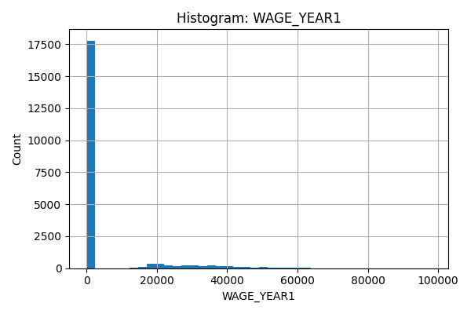

# A05 Data Challenge
## Author: Henry Olson

## Part 1: Data Exploration
### Data Quality
using dtypes and isna I was able to get the following data about the set showing the types and the fact that there are 2745 missing district codes.
DISTRICT_TYPE          object
DISTRICT_NAME          object
DISTRICT_CODE         float64
ACADEMIC_YEAR          object
DEMO_CATEGORY          object
STUDENT_POPULATION     object
AWARD_CATEGORY         object
WAGE_YEAR1            float64
WAGE_YEAR2            float64
WAGE_YEAR3            float64
WAGE_YEAR4            float64

DISTRICT_TYPE            0
DISTRICT_NAME            0
DISTRICT_CODE         2745
ACADEMIC_YEAR            0
DEMO_CATEGORY            0
STUDENT_POPULATION       0
AWARD_CATEGORY           0
WAGE_YEAR1               0
WAGE_YEAR2               0
WAGE_YEAR3               0
WAGE_YEAR4               0

### Range
Each of the columns can have the following unique values:
COLUMN: DISTRICT_TYPE
Number of unique values: 3
Example values: ['School District' 'Legislative District' 'All']

COLUMN: DISTRICT_NAME
Number of unique values: 692
Example values: ['Duarte Unified' 'Coronado Unified' 'Gilroy Unified' 'Pleasant Valley'
 'Senate District 15' 'Adelanto Elementary' 'Assembly District 56'
 'Klamath-Trinity Joint Unified' 'Modoc Joint Unified'
 'Healdsburg Unified']

COLUMN: ACADEMIC_YEAR
Number of unique values: 1
Example values: ['2018-2019']

COLUMN: DEMO_CATEGORY
Number of unique values: 5
Example values: ['Race' 'Homeless Status' 'All' 'Foster Status' 'Gender']

COLUMN: STUDENT_POPULATION
Number of unique values: 15
Example values: ['None Reported' 'Black or African American'
 'Did Not Experience Homelessness in K-12'
 'American Indian or Alaska Native'
 'Native Hawaiian or Other Pacific Islander' 'All' 'Two or More Races'
 'Foster Youth' 'Female' 'White']

COLUMN: AWARD_CATEGORY
Number of unique values: 4
Example values: ["Bachelor's Degree - Did Not Transfer" 'Associate Degree'
 'Community College Certificate' "Bachelor's Degree - Transferred"]

Further the ranges for each numeric colum are as follows:
	            min	        max
DISTRICT_CODE	110017.0	5872769.0
WAGE_YEAR1	    0.0	        97993.0
WAGE_YEAR2	    0.0	        132847.0
WAGE_YEAR3	    0.0     	146728.0
WAGE_YEAR4	    0.0	        153910.0

From the following example histogram we can see that the wages are all left skewed because more people have a lower salary. See notebook file for all histograms:

### Semantics
Each column in the dataset has a clear meaning.
DISTRICT_TYPE, DISTRICT_NAME, and DISTRICT_CODE identify the geographic district associated with the wage data, although DISTRICT_CODE is merely an identifier.
ACADEMIC_YEAR indicates the cohort year. 
DEMO_CATEGORY specifies the demographic category, while STUDENT_POPULATION identifies the specific subgroup within that category so these two are related. 
AWARD_CATEGORY captures the educational outcome earned. This is directly related to wage. 
The WAGE_YEAR1–4 variables represent median earnings in each year after school.
